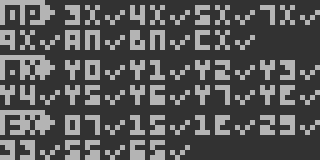
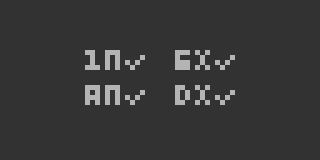

#### chiptest:



```
OP:		3XNN	4XNN	5XY0	7XNN
9XY0	ANNN	BNNN	CXNN
8X:		8XY0	8XY1	8XY2	8XY3
8XY4	8XY5	8XY6	8XY7	8XYE
FX:		FX07	FX15	FX1E	FX29
FX33	FX55	FX65
```

Notes:

* ANNN: Mandatory. No image will load without it.
* CXNN: There's a 1 in 256 chance that it'll return a false positive.
* 8XY4: Carry check not implemented.
* 8XY6/8XYE: Ambiguous instruction. 8XYE fails in Octo.
* FX07/FX15: Fails if emulation is slow.
* FX29: Doesn't work in Octo as its implementation is masked.

#### chiptest-mini:



```
1NNN	6XNN
ANNN	DXYN
```

Notes:

1NNN (optional): Used to loop through a single instruction infinitely. Test will still work without implementing it but will reach the end of memory.